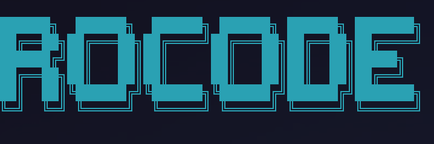
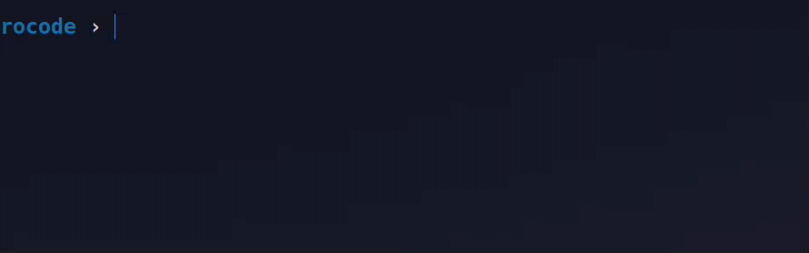
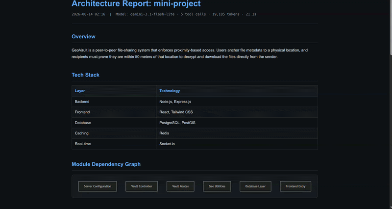
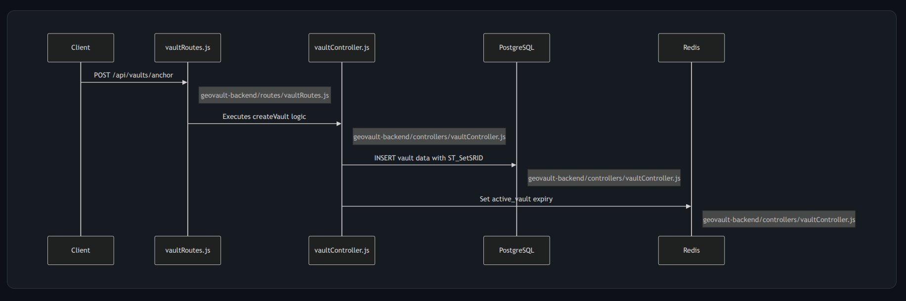
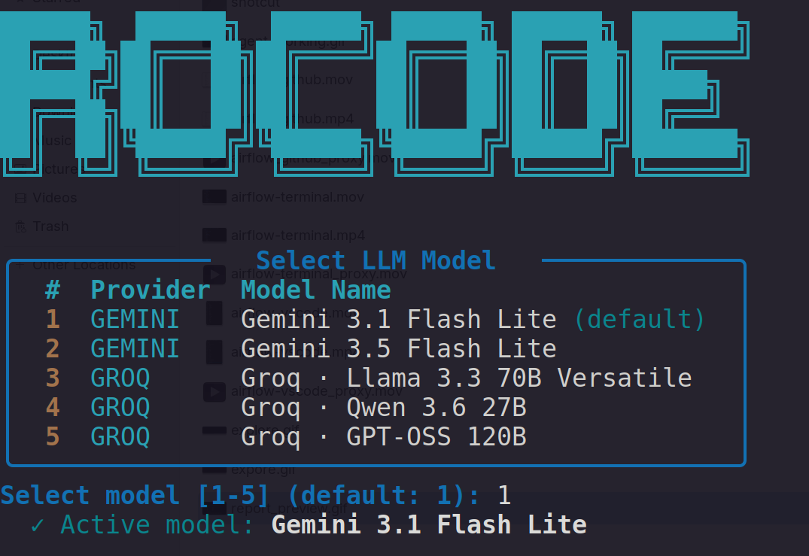
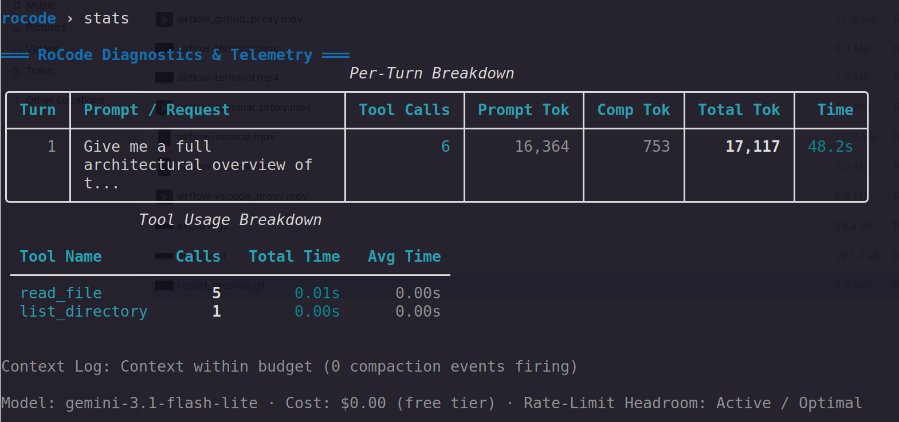
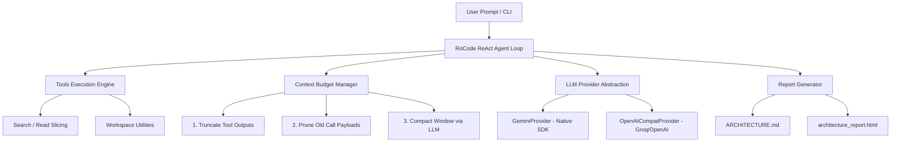

<!-- 
  PLACEHOLDER: docs/assets/cli_screenshot.png
  Recommended Screenshot: "Streaming Prose"
  Capture a shot showing Markdown rendering while streaming (with bold/code blocks), representing a standard user interaction.
-->

# RoCode 

> An intelligent, search-first AI coding agent that explores unfamiliar codebases, manages its own context budget, and generates interactive architecture reports with dependency diagrams.

---


## 🎬 Demo

<!-- 
  PLACEHOLDER: docs/assets/rocode_demo.gif
  Recommended Screenshot: "Demo GIF"
  Capture a looping GIF showing RoCode exploring a repository, executing search tools, and streaming the output.
-->

*Watch RoCode explore a repository, execute search-first tools, and stream structured architecture reports in real time.*

<!-- 
  PLACEHOLDER: docs/assets/report_preview.png and docs/assets/mermaid_graph.png
  Recommended Screenshot: "Architecture Report"
  Capture a view of the generated `architecture_report.html` (the payoff) and a zoomed-in shot of the Mermaid dependency graph.
-->
| Interactive Architecture Report | Dependency Graph |
| :---: | :---: |
|  |  |

---

## 💡 Why RoCode Exists

Dropping into a multi-thousand-line codebase is overwhelming. Traditional LLM tools often attempt to solve this by dumping raw source files directly into the context window. This **naive context stuffing** fails rapidly:
- **Token Explosion**: Prompts blow past context windows within minutes.
- **Hallucinations**: Large context windows dilute LLM attention, leading to invented function signatures.
- **High Latency & Cost**: Processing redundant file contents slows response time and inflates API costs.

**RoCode** addresses this with a **search-first architecture**. Instead of reading entire files blindly, RoCode acts like a human senior engineer: it inspects directory structures, searches for key symbols, traces call graphs incrementally, and manages its own context budget.

---

## ✨ Features

- 🔍 **Search-First Exploration**: Locates relevant code via symbol search (`search_files`) and targeted line range reads (`read_file_part`) rather than dumping entire files.
- ⚡ **Zero-Latency Stack Detection**: Instantly parses repository manifest files (`package.json`, `pyproject.toml`, `go.mod`, etc.) locally before invoking the LLM.
- 📊 **Structured Architecture Reports**: Generates comprehensive `.rocode/ARCHITECTURE.md` and standalone dark-themed `.rocode/architecture_report.html` files complete with Mermaid `graph TD` module maps and sequence flow diagrams.
- 🛡️ **4-Stage Context Budget Management**: Automatically handles output truncation, token monitoring, old tool payload pruning, and LLM-powered context compaction.
- 🎨 **Rich Terminal Presentation**: Features interactive model selection, real-time word-by-word streaming markdown, colored tool action lines, and rate-limit retry protection (429 handling).
  <!-- 
    PLACEHOLDER: docs/assets/startup_menu.png
    Recommended Screenshot: "Startup Menu"
    Capture the model selection table at startup (`ui.select_model`).
  -->
  <br>

- 📈 **3-Tier Diagnostics**: Displays inline per-task footers, session milestone panels, and an on-demand `stats` diagnostic table.
  <!-- 
    PLACEHOLDER: docs/assets/diagnostic_stats.png and docs/assets/task_footer.png
    Recommended Screenshots: "Detailed Stats" and "Task Footer"
    Capture the terminal showing the diagnostic table (`stats` command output) and a zoomed-in shot of the brief dimmed footer line at the end of a turn.
  -->
  <br>

---

## 🏗️ Architecture & Harness Design

RoCode is built around a decoupled, multi-layered agent harness:



### Key Components

1. **ReAct Execution Engine**: Manages the multi-turn action loop, enforces `MAX_TURNS` bounds, and handles malformed tool arguments automatically.
2. **Provider Abstraction Layer (`llm.py`)**: Abstract `LLMProvider` interface powering:
   - `GeminiProvider`: Uses the native `google-genai` SDK with native thought/raw content handling.
   - `OpenAICompatProvider`: Wraps OpenAI-compatible endpoints (e.g. Groq, OpenRouter).
3. **4-Stage Context Pipeline (`context_mgm.py`)**:
   - **Stage 1: Truncation**: Caps raw stdout from bash/tool execution to prevent immediate overflow.
   - **Stage 2: Tracking**: Monitors cumulative prompt/completion tokens per call.
   - **Stage 3: Pruning**: Replaces old tool result payloads with short references while preserving system instructions and recent conversation history.
   - **Stage 4: Compaction**: Automatically summarizes historical turns when token thresholds (`TOKEN_LIMIT`) are exceeded.
4. **Structured Report Generator (`report.py`)**: Enforces JSON Schema validation on LLM output and renders both Markdown and standalone HTML reports with client-side `mermaid.js` rendering.

---

## 🚀 Quickstart

### Prerequisites

- Python 3.10+
- An API key for **Google Gemini** or **Groq**

### 1. Installation

```bash
# Clone the repository
git clone https://github.com/rohit/RoCode.git
cd RoCode

# Create and activate a virtual environment
python3 -m venv .venv
source .venv/bin/activate

# Install dependencies
pip install -r requirements.txt
```

### 2. Configure Environment Variables

Create a `.env` file in the project root:

```bash
# Set your preferred API keys
GEMINI_API_KEY=your_gemini_api_key_here
GROQ_API_KEY=your_groq_api_key_here
```

### 3. Run RoCode

```bash
# Launch RoCode on any local repository
python agent.py /path/to/target/repository
```

---

## 💻 Usage & Commands

Upon launching RoCode, you will be prompted to select an active LLM model:

```text
╭───────────────────────   Select LLM Model   ───────────────────────╮
│  #  Provider  Model Name                                           │
│  1  GEMINI    Gemini 3.1 Flash Lite (default)                      │
│  2  GEMINI    Gemini 3.5 Flash Lite                                │
│  3  GROQ      Groq · Llama 3.3 70B Versatile                       │
│  4  GROQ      Groq · Qwen 3.6 27B                                  │
│  5  GROQ      Groq · GPT-OSS 120B                                  │
╰────────────────────────────────────────────────────────────────────╯
Select model [1-5] (default: 1): 
```

### Interactive CLI Commands

- `explore`: Triggers a full codebase discovery pass, generating `.rocode/ARCHITECTURE.md` and `.rocode/architecture_report.html`.
- `stats` or `tokens`: Opens the diagnostic view showing per-turn token usage, tool latency, and context optimization logs.
- `clear`: Resets active conversation context and provider state.
- `quit` or `exit`: Displays the session summary panel and exits.

### Example Conversation

```text
rocode › What handles database migrations in this repo?

Agent:
  → search_files  pattern="migration"
  ✓ found 4 matches
  → read_file_part  path="alembic/env.py"  offset=1  limit=40
  ✓ 40 lines

Database migrations are managed by Alembic in `alembic/env.py`. The configurations are loaded from `alembic.ini`.

  2 tool calls · 1,420 tokens · 3s · $0.00 (free tier)
```

---

## ⚖️ Design Decisions & Tradeoffs

1. **Search-First vs. Full Repository Ingestion**:
   - *Tradeoff*: Search-first requires multiple tool calls to locate symbols, adding slight initial turn round-trips.
   - *Rationale*: Drastically reduces context window usage, avoids attention degradation on large codebases, and ensures answers are backed by verified line citations.

2. **Lossy Output Pruning**:
   - *Tradeoff*: Replacing old tool outputs with summary placeholders means early raw tool returns are no longer verbatim in history.
   - *Rationale*: Tool outputs consume up to 80% of context tokens. Retaining recent tool outputs while pruning older ones preserves context headroom without degrading multi-turn reasoning.

3. **Multi-Format Report Output (Markdown + Standalone HTML)**:
   - *Tradeoff*: Requires parallel rendering pipelines.
   - *Rationale*: Markdown is ideal for Git version control (`ARCHITECTURE.md`), while standalone HTML (`architecture_report.html`) delivers an instant, zero-dependency visual dashboard with dark-mode styling and interactive Mermaid graphs.

4. **v1 Scope Boundary**:
   - *Deliberate Exclusion*: v1 focuses on codebase comprehension, architecture mapping, and single-file targeted edits. Unconstrained multi-file refactoring and root-level bash execution were intentionally scoped out to maintain execution safety and precision.

---

## 🗺️ Roadmap

- [ ] **Multi-File Atomic Refactoring**: Support coordinated multi-file edits with automated rollback.
- [ ] **Docker Sandbox Integration**: Execute bash commands and unit tests within an isolated container.
- [ ] **Vector-Hybrid Indexing**: Combine lexical search with local embeddings for repositories >50,000 files.
- [ ] **CI/CD Architecture Guard**: Run architecture report checks in GitHub Actions to detect structural drift.

---

## 🛠️ Tech Stack

- **Core**: Python 3.10+
- **Terminal UI**: [Rich](https://github.com/Textualize/rich)
- **LLM SDKs**: `google-genai` (Gemini), `openai` (Groq & OpenAI-compatible endpoints)
- **Environment & Utilities**: `python-dotenv`, `pyfiglet`
- **Diagram Engine**: [Mermaid.js](https://mermaid.js.org/)

---

## 📜 License

MIT License. See [LICENSE](LICENSE) for details.
